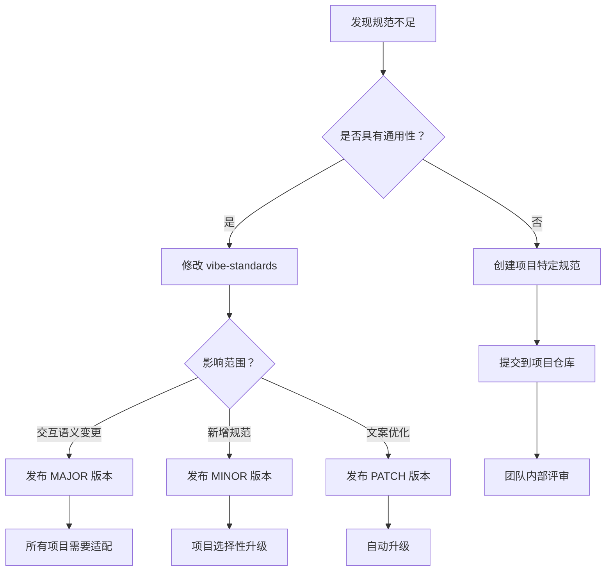

# Vibe Standards 使用指南

完整的新项目接入和团队协作迭代流程。

---

## 📦 场景一：新项目如何使用 Vibe Standards

### 方式 A：作为 Git Submodule 使用（推荐）⭐

**优点**：
- ✅ 自动同步最新规范
- ✅ 多项目共用一份规范
- ✅ 统一的版本管理

**操作步骤**：

#### 1. 在新项目中添加 submodule

```bash
# 进入你的新项目目录
cd /path/to/your-new-project

# 添加 vibe-standards 作为 submodule
git submodule add https://github.com/PANGKAIFENG/-vibe-standards-.git .vibe-standards

# 提交 submodule 配置
git add .gitmodules .vibe-standards
git commit -m "chore: 添加 vibe-standards 规范体系"
```

#### 2. 配置 Claude Code 自动加载规范

创建或编辑项目根目录的 `.claude/settings.json`：

```json
{
  "rules": [
    ".vibe-standards/rules/**/*.md"
  ],
  "agents": [
    ".vibe-standards/agents/**/*.md"
  ],
  "commands": [
    ".vibe-standards/commands/**/*.md"
  ],
  "skills": [
    ".vibe-standards/skills/**/*.md"
  ],
  "contexts": [
    ".vibe-standards/contexts/**/*.md"
  ]
}
```

**或者**在项目根目录创建 `.cursorrules` 文件：

```markdown
# 全局规范引用（必读）

> ⚠️ **强制执行**：在执行任何开发任务前，必须先阅读以下全局规范：
> - 路径：`.vibe-standards/rules/`
> - 全局规范优先级**高于**本项目特定规则（除非明确标注覆盖）

## 产品规范
- PRD 生成规范：`.vibe-standards/rules/01-requirement-prd-standard.md`

## 设计规范
- UI 设计规范：`.vibe-standards/rules/02-design-ui-spec.md`

## 开发规范
- 代码风格：`.vibe-standards/rules/coding-style.md`
- Git 工作流：`.vibe-standards/rules/git-workflow.md`
- 测试要求：`.vibe-standards/rules/testing.md`
- 安全规范：`.vibe-standards/rules/security.md`

## 项目特定规则（覆盖全局规范）

（在此添加项目特定的规则）
```

#### 3. 拉取规范内容

```bash
# 初始化 submodule（首次克隆项目时需要）
git submodule update --init --recursive

# 查看规范文件
ls .vibe-standards/rules/
```

#### 4. 更新规范（同步最新版本）

```bash
# 更新到最新版本
cd .vibe-standards
git pull origin main

# 返回项目根目录并提交更新
cd ..
git add .vibe-standards
git commit -m "chore: 更新 vibe-standards 到最新版本"
```

#### 5. 锁定特定版本（可选）

如果项目需要稳定，可以锁定特定版本：

```bash
cd .vibe-standards
git checkout v1.1.0  # 切换到特定版本

cd ..
git add .vibe-standards
git commit -m "chore: 锁定 vibe-standards 版本为 v1.1.0"
```

---

### 方式 B：直接复制到项目（适合需要深度定制）

**优点**：
- ✅ 完全掌控规范内容
- ✅ 可以大量定制

**缺点**：
- ❌ 需要手动同步更新
- ❌ 多项目无法共用

**操作步骤**：

```bash
# 克隆 vibe-standards
git clone https://github.com/PANGKAIFENG/-vibe-standards-.git

# 复制规范文件到项目
cp -r vibe-standards/rules your-project/docs/standards/
cp -r vibe-standards/agents your-project/.claude/agents/
cp -r vibe-standards/commands your-project/.claude/commands/

# 删除临时目录
rm -rf vibe-standards
```

---

### 方式 C：作为全局配置使用（适合个人开发者）

**操作步骤**：

```bash
# 克隆到固定位置
git clone https://github.com/PANGKAIFENG/-vibe-standards-.git ~/vibe-standards

# 配置 Claude Code 全局设置
# 编辑 ~/.claude/settings.json
{
  "pluginPaths": [
    "~/vibe-standards"
  ]
}
```

这样所有项目都会自动加载这套规范。

---

## 🎨 场景二：项目定制设计规范

新项目通常需要定制自己的设计令牌（颜色、字体等）。

### 1. 复制设计规范到项目

```bash
mkdir -p docs/design-system
cp .vibe-standards/rules/02-design-ui-spec.md docs/design-system/ui-spec.md
```

### 2. 创建项目的设计令牌文件

创建 `docs/design-system/design-tokens.md`：

```markdown
# 项目设计令牌（覆盖全局规范）

> 本项目的设计令牌，基于 vibe-standards UI-Spec v1.0
> 全局规范：`.vibe-standards/rules/02-design-ui-spec.md`

## 颜色系统（项目特定）

\`\`\`yaml
color:
  # 主色 - 根据品牌调整
  primary: "#FF6B00"              # 橙色主色（品牌色）
  primaryHover: "#E65100"

  # 语义色 - 保持通用认知
  danger: "#EF4444"               # 危险/删除（不变）
  success: "#10B981"              # 成功/完成（不变）
  warning: "#F59E0B"              # 警告/提示（不变）
\`\`\`

## 字体系统（项目特定）

\`\`\`yaml
typography:
  fontFamily: "PingFang SC, Microsoft YaHei, sans-serif"  # 使用苹方
\`\`\`

## 其他令牌（使用全局规范）

间距、圆角、阴影、动效等使用 vibe-standards 的默认值。
```

### 3. 在 .cursorrules 中引用

```markdown
# 设计规范（项目定制）

> 设计令牌：`docs/design-system/design-tokens.md`（项目特定）
> 交互规范：`.vibe-standards/rules/02-design-ui-spec.md`（全局规范）

优先级：项目设计令牌 > 全局 UI-Spec
```

这样 AI 会优先使用项目的设计令牌，但遵循全局的交互规范。

---

## 🔄 场景三：团队发现规范不足，如何完善

### 流程 A：通用规范完善（提交到 vibe-standards）

**适用场景**：发现的问题具有通用性，其他项目也会遇到。

#### 1. 在本地修改规范

```bash
# 进入 vibe-standards 目录
cd .vibe-standards  # 如果使用 submodule
# 或
cd ~/vibe-standards  # 如果是全局配置

# 创建新分支
git checkout -b improve/ui-spec-button-loading

# 修改规范文件
vim rules/02-design-ui-spec.md
```

**示例修改**：

```diff
### 3.1 按钮（Button）

\`\`\`yaml
button:
  # 状态
  states:
    - default       # 默认状态
    - hover         # 悬停状态（颜色加深）
    - disabled      # 禁用状态（灰色、不可点击）
    - loading       # 加载状态（显示 spinner）
+   - success       # 成功状态（显示 ✓，2秒后恢复）
+   - error         # 错误状态（显示 ✗，抖动动画）
\`\`\`

+ **新增状态说明**：
+ - **success**：操作成功后短暂显示（2秒），然后恢复默认状态
+ - **error**：操作失败后显示，需要用户手动点击或 3秒后恢复
```

#### 2. 提交并推送

```bash
git add rules/02-design-ui-spec.md
git commit -m "feat(design): 新增按钮 success/error 状态

在实际项目中发现按钮需要成功/错误状态反馈，补充规范。

- 新增 success 状态（显示 ✓，2秒后恢复）
- 新增 error 状态（显示 ✗，抖动动画）
- 添加状态转换时机说明"

git push origin improve/ui-spec-button-loading
```

#### 3. 创建 Pull Request

在 GitHub 上创建 PR：
- 标题：`feat(design): 新增按钮 success/error 状态`
- 描述：
  ```markdown
  ## 问题
  在"新白板"项目开发中，发现按钮需要即时的成功/错误反馈。

  ## 解决方案
  新增按钮的 success 和 error 状态规范。

  ## 截图
  [如果有设计稿，添加截图]

  ## 测试
  - [ ] 在"新白板"项目中验证
  - [ ] 符合现有的设计哲学
  ```

#### 4. 团队评审

- 产品经理：评审是否符合产品需求
- 设计师：评审是否符合设计原则
- 开发人员：评审是否易于实现

#### 5. 合并并发布新版本

PR 合并后，由维护者发布新版本：

```bash
# 更新版本号（MINOR 版本）
git tag -a v1.2.0 -m "v1.2.0 - 新增按钮状态反馈"
git push origin v1.2.0
```

#### 6. 项目同步新规范

```bash
# 在你的项目中更新 submodule
cd your-project
git submodule update --remote .vibe-standards

git add .vibe-standards
git commit -m "chore: 更新 vibe-standards 到 v1.2.0"
```

---

### 流程 B：项目特定规范（保留在项目内）

**适用场景**：发现的问题是项目特定的，不具有通用性。

#### 1. 在项目中创建补充规范

```bash
# 在项目中创建补充规范
mkdir -p docs/standards/supplements
vim docs/standards/supplements/ui-spec-project-specific.md
```

**内容示例**：

```markdown
# 项目特定 UI 规范（补充）

> 基于 vibe-standards UI-Spec v1.1.0
> 以下是项目特定的补充规范

## 业务组件规范

### 任务卡片（TaskCard）

\`\`\`yaml
taskCard:
  width: 320px              # 固定宽度
  height: auto              # 高度自适应
  layout: vertical          # 垂直布局

  sections:
    - header: 任务标题 + 状态标签
    - body: 任务描述（最多 2 行）
    - footer: 负责人头像 + 截止日期
\`\`\`

**使用场景**：
- 任务列表页
- 看板视图
- 我的任务页面
```

#### 2. 在 .cursorrules 中引用

```markdown
# 项目规范（补充全局规范）

> 全局规范：`.vibe-standards/rules/`
> 项目补充：`docs/standards/supplements/`

## 优先级

1. 项目特定规范（`docs/standards/supplements/`）
2. 全局规范（`.vibe-standards/rules/`）
```

#### 3. 提交到项目仓库

```bash
git add docs/standards/supplements/ui-spec-project-specific.md
git add .cursorrules
git commit -m "docs: 新增项目特定 UI 规范补充"
git push origin main
```

---

## 📊 规范迭代决策树



**判断通用性的标准**：

| 场景 | 是否通用 | 示例 |
|------|---------|------|
| 按钮状态规范 | ✅ 是 | success/error 状态 |
| 弹窗确认流程 | ✅ 是 | 二次确认机制 |
| 特定业务组件 | ❌ 否 | 任务卡片、看板 |
| 项目主色 | ❌ 否 | #FF6B00 橙色 |
| 特定字体 | ❌ 否 | 某个付费字体 |

---

## 🔄 完整的团队协作流程

### 1. 项目启动阶段

```bash
# 产品经理
1. 创建项目仓库
2. 添加 vibe-standards 作为 submodule
3. 配置 .cursorrules

# 设计师
1. 基于 UI-Spec 定制项目的设计令牌
2. 创建 docs/design-system/design-tokens.md
3. 在 Figma 中应用设计令牌

# 开发人员
1. 拉取项目代码
2. 初始化 submodule（自动加载规范）
3. 开始开发（AI 自动遵循规范）
```

### 2. 开发迭代阶段

```bash
# 开发过程中
1. AI 按照规范生成代码
2. 发现规范不足或问题
3. 记录到 GitHub Issues

# 每周团队会议
1. 评审本周发现的规范问题
2. 决定哪些提交到 vibe-standards
3. 分配完善任务
```

### 3. 规范完善阶段

```bash
# 有人负责完善规范
1. 在 vibe-standards 创建分支
2. 修改规范文档
3. 创建 PR，团队评审
4. 合并后发布新版本

# 项目同步
1. git submodule update --remote
2. 验证新规范是否影响现有功能
3. 提交更新
```

### 4. 定期回顾阶段

```bash
# 每月/每季度
1. 回顾规范使用情况
2. 统计规范覆盖率
3. 计划下一阶段的规范完善方向
```

---

## 📝 实际案例：新白板项目使用 vibe-standards

### 背景

新白板项目需要开发一个任务管理功能。

### 步骤 1：接入规范

```bash
cd 新白板
git submodule add https://github.com/PANGKAIFENG/-vibe-standards-.git .vibe-standards
```

### 步骤 2：编写 PRD

产品经理使用 `.vibe-standards/rules/01-requirement-prd-standard.md` 编写 PRD：

```markdown
# 任务管理功能 PRD

## 1. 功能目标
让用户能够创建、查看、编辑和删除任务，提升团队协作效率。

## 2. 用户场景

### 场景 A：创建任务
> 小王收到老板的邮件，需要完成设计稿。他想在系统中创建一个任务记录。

**用户诉求**：快速创建任务，记录关键信息

...（按 PRD 规范的 8 大章节编写）
```

### 步骤 3：设计 UI

设计师参考 `.vibe-standards/rules/02-design-ui-spec.md`，使用项目的设计令牌：

```yaml
# 新白板的设计令牌
color:
  primary: "#0032FF"  # 蓝色主色
```

在 Figma 中设计任务列表页，遵循 UI-Spec 的布局模式（列表页）。

### 步骤 4：开发实现

开发人员打开 Claude Code，AI 自动加载规范：

```tsx
// AI 生成的代码自动遵循规范
import { Button } from '@/components/Button'

function TaskList() {
  return (
    <div className="task-list">
      {/* 遵循列表页布局模式 */}
      <header>
        <h1>任务列表</h1>
        <Button variant="primary">+ 新建任务</Button>  {/* 一个主按钮 */}
      </header>

      {/* 表格 */}
      <table>...</table>

      {/* 分页 */}
      <Pagination />
    </div>
  )
}
```

### 步骤 5：发现规范不足

在开发"删除任务"功能时，发现 UI-Spec 没有规定批量删除的确认弹窗。

**记录 Issue**：
```markdown
标题：UI-Spec 缺少批量删除确认规范

描述：
- 当前规范只有单个删除的确认弹窗
- 批量删除时应该显示影响数量
- 建议补充规范

标签：enhancement, design
```

### 步骤 6：完善规范

设计师在 vibe-standards 创建 PR，补充批量删除规范：

```diff
### 2.2 破坏性操作（Destructive Actions）

+ # 特殊情况
+ batch_operation:
+   showAffectedCount: true       # 显示影响数量
+   example: "确定要删除 5 个任务吗？"
```

### 步骤 7：同步更新

PR 合并后，新白板项目同步：

```bash
git submodule update --remote .vibe-standards
git add .vibe-standards
git commit -m "chore: 同步 vibe-standards 批量删除规范"
```

---

## 🎯 最佳实践

### 1. 新项目启动清单

- [ ] 添加 vibe-standards 作为 submodule
- [ ] 配置 .cursorrules 引用规范
- [ ] 创建项目的设计令牌文件
- [ ] 团队培训：让所有成员了解规范位置和内容
- [ ] 第一个功能开发前，产品/设计/开发一起过一遍规范

### 2. 规范使用清单

**产品经理**：
- [ ] 编写 PRD 前，阅读 01-requirement-prd-standard.md
- [ ] PRD 包含 8 大章节
- [ ] 用户场景具体、有痛点

**设计师**：
- [ ] 设计前，确认项目设计令牌
- [ ] 交互遵循 UI-Spec 的交互语义
- [ ] 组件符合 UI-Spec 的组件规范
- [ ] 布局使用 UI-Spec 的标准模式

**开发人员**：
- [ ] 开发前，确认 AI 已加载规范
- [ ] 代码符合 coding-style 规范
- [ ] 提交信息符合 git-workflow 规范
- [ ] 测试覆盖率 ≥ 80%

### 3. 规范完善清单

- [ ] 发现问题时，先记录 Issue
- [ ] 每周团队会议评审 Issues
- [ ] 通用问题提 PR 到 vibe-standards
- [ ] 项目特定问题补充到项目文档
- [ ] 每次发布都更新 CHANGELOG

---

**最后更新**：2026-02-02
**维护者**：Vibe 团队
